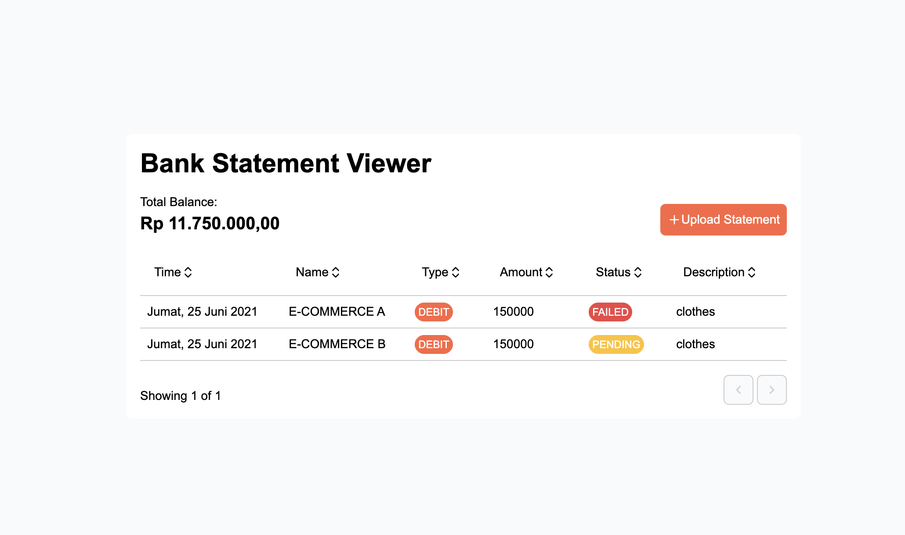
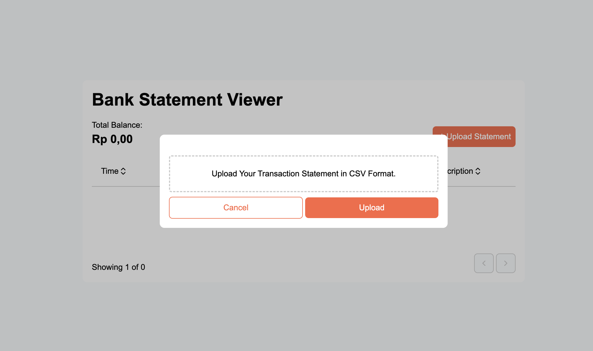
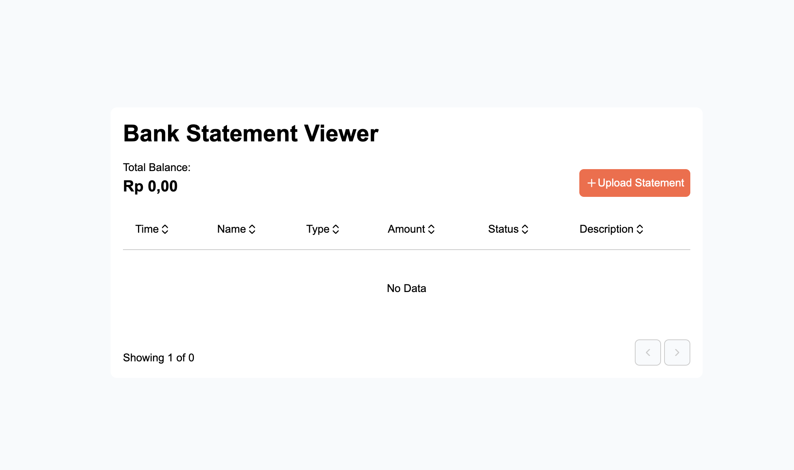

# Simple Bank Statement Viewer Simulation

- https://bank-statement-viewer.fahrezy.work
- https://api-bank-statement-viewer.fahrezy.work/swagger

## Front End

### Project Structure

```
project-root/
└── src/
    ├── app                             # Next.js default directory for routing
    ├── components/                     # Shareable global component accross the project
    │   └── <component-name>/
    │       ├── index.tsx
    │       ├── index.test.tsx
    │       └── styles.module.css
    ├── features/                       # Feature / domain specific code (components, hooks, utils, etc)
    │   └── <feature-name>/
    │        └── <components>/
    │            ├── index.tsx
    │            ├── index.test.tsx
    │            └── styles.module.css
    ├── hooks/                          # Shareable global React's cusom hook accross the project
    │   └── <hook-name>.ts
    ├── services/                       # SDK for external API service
    │    └── <service-name>/
    │        ├── api-sdk.ts
    │        └── api.types.ts
    └── utils/                          # Shareable utility function
        └── <util-name>.ts
```

### Prerequisites

- Node.js 22 or higher
- npm 10 or higher
- pnpm 10 or higher

### Quick Start

#### Local Development

1. **Clone the repository**:
   ```bash
   git clone <repository-url>
   cd <clone directory>
   ```

2. **Install dependencies**:
   ```bash
   pnpm install
   ```

3. **Setup environment**:
   ```bash
   cp .env.example .env
   # Edit values on the .env with the real value if needed
   ```

5. **Start the development**:
   ```bash
   pnpm run dev
   ```


### Testing

```bash
# Run all tests
pnpm test
```

### Build the Application

#### With Docker

```bash
docker compose up --build
```

#### Without Docker

```bash
pnpm build
```

## Back End

### Project Structure

```
project-root/
├── cmd/
│   ├── http_server/     # HTTP server entry point
│   │   └── main.go      # Main application with Swagger annotations
├── config/              # Configuration management
│   └── config.go        # Config loading with .env file support
├── feature/             # Feature-based modules
│   └── <feature_name>/  # Example feature
│       ├── repository/  # Data access layer
│       │   ├── repository.go
│       │   ├── repository_interface.go
│       │   ├── <method>.go
│       │   ├── <method>_dto.go
│       │   └── <method>_test.go
│       ├── service/     # Business logic layer
│       │   ├── service.go
│       │   ├── service_interface.go
│       │   ├── <method>.go
│       │   └── <method>_dto.go
│       │   └── <method>_test.go
│       └── handler/     # Presentation layer
│           ├── http.go  # Main HTTP handlers with Swagger docs
├── internal/            # Shared packages
│   ├── database/        # Database connection management
│   ├── logger/          # Structured logging utilities
│   └── http_server/     # Generic HTTP server with Swagger middleware
├── docs/                # Generated Swagger documentation
└── Makefile             # Build and development commands
```

### Prerequisites

- Go 1.25 or higher
- Make (optional, for build automation)

### Quick Start

#### Local Development

1. **Clone the repository**:
   ```bash
   git clone <repository-url>
   cd <clone directory>
   ```

2. **Install dependencies**:
   ```bash
   go mod download
   ```

3. **Setup environment**:
   ```bash
   cp .env.example .env
   # Edit values on the .env with the real value if needed
   ```

4. **Generate API documentation**:
   ```bash
   make swagger
   ```

5. **Start the server**:
   ```bash
   make run
   ```

### Testing

```bash
# Run all tests
make test
```

### Build the Application

#### With Docker

```bash
docker compose up --build
```

#### Without Docker

```bash
make build-production
```

## Architecture decisions

- Use `Next.js` for front-end to support different rendering in the future. For now it's use client side rendering, by using meta-framework that already support for SSR / SSG, it unlock the potential for use different rendering approach. Other advantage of using meta-framework, it give developer an out-of-the box tools like routing or ready to use custom hooks to interact with the components on the web (e.g, query param)
- Use `net/http` for API server on the back-end for simplicity and make less dependencies.
- For the back-end project, it use dependency inversion to achieve low coupling.
- Both front-end and back-end use mixing between vertical slice and horizontal slice architecture. For feature / domain specific codes, the codes will be inside the same working dir, maintain the code colocation close to each other. For shareable codes, it will be spread accross the main folder because relation for that code is the project instead of a feature.
- Front-end and back-end deployment deployed on different container to have separate deployment.


## Screenshot

| Image | Description | 
| ------ | ------ |
|  | Statement already uploaded |
|  | Uploading statement file |
|  | Empty state |


## Demo

https://drive.google.com/file/d/1BvmbwDbIMe_0JTmTezmoBNtbb8gSoKH6/view